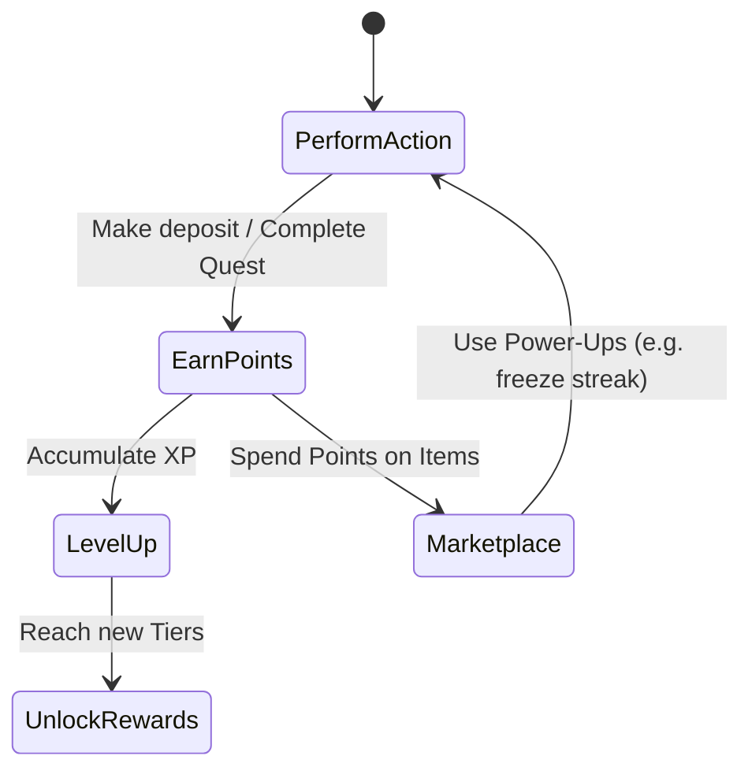

# KopDes — Gamified Village Cooperative Platform

> HackathonKopdes — Digital cooperative management for Indonesian *Koperasi Merah Putih Desa* (village cooperatives).
> A monorepo with **two apps sharing one Supabase (PostgreSQL) backend**: a Next.js admin dashboard and a Flutter web/mobile app for members.

---

## Table of Contents

- [What is KopDes?](#what-is-kopdes)
- [Key Features](#key-features)
- [Tech Stack & Infrastructure](#tech-stack--infrastructure)
  - [Supabase](#supabase)
  - [Xendit Integration](#xendit-integration)
- [System Architecture](#system-architecture)
- [The Two Apps](#the-two-apps)
- [Core Domain Model & Gamification Loop](#core-domain-model--gamification-loop)
- [Database Schema](#database-schema)
- [API Reference](#api-reference)
- [Quick Start](#quick-start)
- [Building the Mobile APK](#building-the-mobile-apk)
- [CI/CD & Testing](#cicd--testing)

---

## What is KopDes?

**KopDes (Koperasi Digital)** is a modern Indonesian village cooperative platform that integrates traditional financial services with **gamification**, a **member-to-member marketplace**, and **community engagement**. 

In traditional Indonesian cooperatives (Koperasi), member participation often dwindles because the interactions are purely transactional and feel outdated. KopDes solves this by making cooperative participation feel as engaging as a mobile game, while keeping all the rigour of real accounting, savings, loans, and member governance.

The platform targets *Koperasi Merah Putih Desa* — the village-level cooperatives that form the backbone of rural Indonesian community finance. 

---

## Key Features

- **Digital Financial Services** — Track Savings (*Simpanan Pokok, Wajib, Sukarela*) and Loans (*Pinjaman*) with a full audit trail.
- **KopDes Arena (Gamification Layer)**
  - Complete **Daily Quests** to earn XP and Points.
  - Maintain a **Login Streak** for bonus rewards.
  - Compete in **Weekly Arena Battles** against other members (auto-matched) based on financial activity.
- **Member-to-Member Marketplace** — Spend points to list and buy items in a P2P marketplace. Includes virtual "Power-Up" items with effects (e.g., `freeze_streak`, `prank`).
- **Cooperative Governance (E-RAT)** — Digital voting system where members vote on proposals (*Setuju / Tolak / Abstain*).
- **Multi-Platform** — Desktop admin dashboard for operators and a mobile-first app for cooperative members.

---

## Tech Stack & Infrastructure

KopDes utilizes modern cloud-native tools to provide scalable, secure, and rapid development capabilities.

| Layer | Technology |
|---|---|
| Desktop dashboard | Next.js 15 (App Router), TypeScript, Tailwind CSS |
| Member app | Flutter, Dart 3.6 (web + Android + iOS) |
| Database | PostgreSQL via Supabase |
| Payment Gateway | Xendit |
| ORM | Drizzle ORM |
| Auth | Supabase Auth (email/password, JWT) |
| API style | Next.js Server Actions (web) + REST Route Handlers (mobile) |
| Deployment | Vercel (Next.js + Flutter web) |

### Supabase

**Supabase** acts as the core backend-as-a-service (BaaS) for KopDes, powering two critical infrastructure layers:

1. **PostgreSQL Database:** All application data (members, transactions, quests, battles) is stored in a relational PostgreSQL database. We use **Drizzle ORM** from the Next.js server to perform type-safe queries and mutations. 
2. **Supabase Auth:** Handles user registration, login, and JWT (JSON Web Token) generation. The Next.js app validates these JWTs to securely identify which member is making a request.

### Xendit Integration

**Xendit** is utilized as the primary Payment Gateway to bridge the digital and physical financial worlds for the cooperative members.

- **Seamless Top-ups:** Members can instantly top-up their digital cooperative wallet or pay their mandatory savings (*Simpanan Wajib*) using Virtual Accounts (BCA, Mandiri, BRI), E-Wallets (OVO, GoPay, Dana), or QRIS provided by Xendit.
- **Automated Disbursement:** When members request loan disbursements or withdraw their voluntary savings (*Simpanan Sukarela*), Xendit automates the bank transfers directly into the member's registered bank account, drastically reducing the manual administrative overhead for cooperative staff.
- **Webhooks:** Xendit securely notifies the KopDes Next.js backend via webhooks whenever a payment succeeds, ensuring member balances are updated in real-time.

---

## System Architecture

KopDes follows a dual-client architecture sharing a single secure backend server. The Flutter app communicates exclusively via a REST API exposed by Next.js, meaning the Next.js server acts as the single source of truth and security enforcer before hitting Supabase.

```mermaid
flowchart TD
    subgraph Clients
        A[Next.js Desktop App\n(Cooperative Admins & Web Members)]
        B[Flutter Mobile App\n(Android / iOS / Web)]
    end

    subgraph Backend Server [Next.js API & Server Actions]
        C[Next.js App Router]
        D[Supabase Auth Guard / Middleware]
        E[REST Route Handlers\n/api/mobile-sync]
        F[Server Actions\n(Database Mutators)]
        
        C --> D
        E --> D
        F --> D
    end
    
    subgraph External Infrastructure
        G[(Supabase PostgreSQL)]
        H[Xendit Payment Gateway]
    end

    A -- "Server Actions (Direct)" --> C
    B -- "REST API (HTTP/JSON)" --> E
    
    D -- "Validates JWT" --> G
    C -- "Queries via Drizzle ORM" --> G
    E -- "Queries via Drizzle ORM" --> G
    F -- "Mutates Data via Drizzle" --> G
    
    F -- "Generates Payment Links\n/ Disburses Funds" --> H
    H -- "Webhooks (Payment Success)" --> C
```

---

## Core Domain Model & Gamification Loop

KopDes revolves around turning traditional financial habits into an engaging game loop. 



1. **Points & XP:** Members earn points/XP from quests, battles, events, and financial activity (e.g., depositing savings).
2. **Member-to-Member Marketplace:** Points are spent in a P2P marketplace. Members list their own real or virtual goods, and others buy them. Power-Ups (like `freeze_streak` or `prank`) can also be bought here.
3. **Ranks & Levels:** XP raises the member's level. Ranks are assigned based on level thresholds (Perunggu -> Perak -> Emas -> Platinum -> Legenda).
4. **Arena Battles (Weekly PvP):** The system automatically matches members into 1v1 battles weekly. The player who earns the most points during that week wins the battle, fostering friendly financial competition.

---

## Database Schema

Key tables powering the platform:

| Table | Purpose |
|---|---|
| `users` | Supabase auth users (UUID) |
| `cooperatives` | Cooperative entity details |
| `members` | Member profiles linked to cooperatives |
| `member_progress` | Level, XP, points balance, streaks |
| `point_transactions` | History of points earned/spent |
| `savings` / `loans` / `dues` | Core financial ledgers |
| `battles` | PvP weekly battle tracking |
| `quests` / `member_quests` | Gamified mission definitions and completion |
| `marketplace_items` | P2P marketplace listings |
| `proposals` / `votes` | Governance and E-RAT voting system |

---

## API Reference

The Flutter app connects to the Next.js backend via a streamlined REST API.

### `POST /api/auth/login`
Authenticates the user and returns a Supabase JWT.
```json
{
  "success": true,
  "token": "eyJhbGciOi...", 
  "memberId": 42
}
```

### `GET /api/mobile-sync` 
Returns a massive JSON bundle covering the entire state of the app for that user (Quests, Balances, Arena stats, Marketplace items). This eliminates the need for multiple REST calls, ensuring low latency on mobile connections.

### `POST /api/mobile-sync/action` 
A unified GraphQL-style action endpoint.
```json
{ "action": "complete_quest", "questId": 1 }
// or
{ "action": "purchase_item", "itemId": 12 }
```

---

## Quick Start

### Prerequisites
- **Node.js** 20+ and npm 10+
- **Flutter** 3.27+ with Dart 3.6+
- A **Supabase** project (free tier)

### Clone & Install

```bash
git clone https://github.com/danarrigo/HackathonKopdes
cd HackathonKopdes
npm install
```

### Set up the Environment

```bash
cp desktop/.env.example desktop/.env.local
# Fill in your Supabase & Xendit credentials
```

### Run Locally

```bash
# Terminal 1 — Desktop dashboard (Next.js)
cd desktop
npm run dev                       # Runs on http://localhost:3000

# Terminal 2 — Mobile App (Flutter Web)
cd mobile
flutter pub get
flutter run -d chrome --web-port 3001 --web-hostname localhost
```

---

## Building the Mobile APK

To build an Android APK for field testing:

```bash
cd mobile
flutter pub get

# Debug APK (Single fat APK)
flutter build apk --debug

# Release APK (Optimized)
flutter build apk --release
```

---

## CI/CD & Testing

We enforce code quality via GitHub Actions.

- **Desktop (`desktop-ci.yml`):** Runs `npm run lint`, `tsc --noEmit`, and `jest` tests.
- **Mobile (`mobile-ci.yml`):** Runs `dart format`, `flutter analyze`, and `flutter test`.

Vercel automatically deploys the Next.js app on every push to `main`.

---

*Built with ❤️ for the advancement of Indonesian village cooperatives.*
